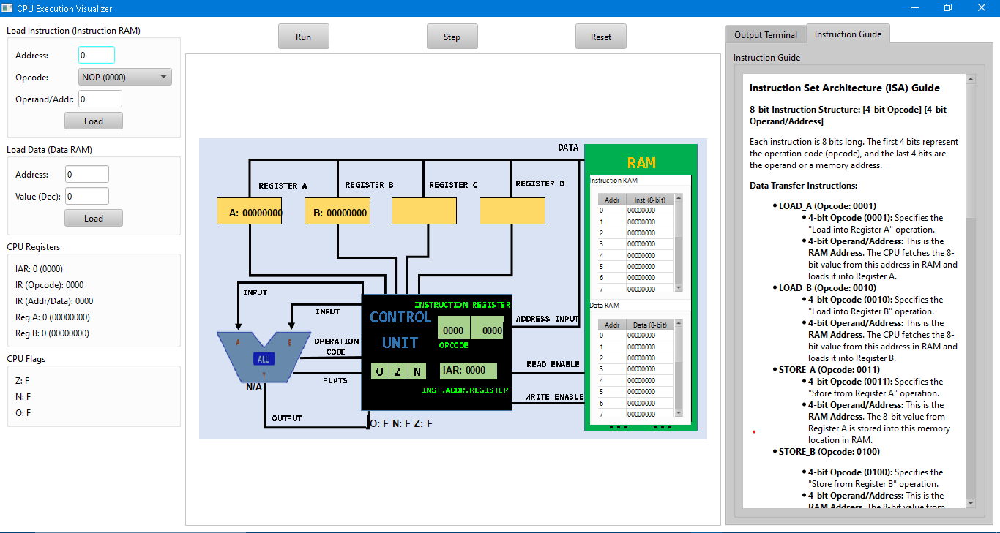
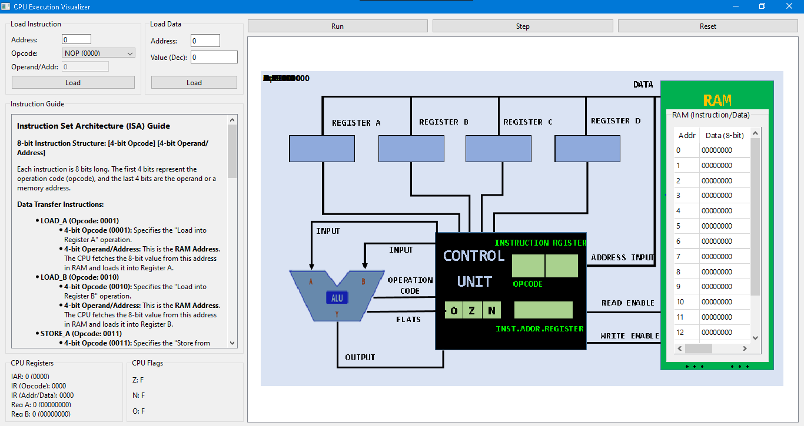

### CPU Execution Visualizer
<p align="center">
  <h3>Main Interface</h3>
  
  <br>
  <em>The main application interface – where all functionalities are intuitively connected.</em>
</p>

<p align="center">
  <h3>Main Interface</h3>
  
  <br>
  <em>The main application interface - program running subtract operator between 2 register a and register b.</em>
</p>

A hands-on, visual simulator for a custom 8-bit CPU. This project provides a graphical user interface (GUI) built with PyQt6 to demonstrate the fundamental concepts of computer architecture, including the CPU's internal components, memory, and the instruction execution pipeline. Users can interactively step through a program and observe data flow and component states in real-time.

#### Features
- **Interactive CPU Diagram:** A graphical representation of the CPU's architecture, including the Instruction Address Register (IAR), Instruction Register (IR), Registers A and B, RAM, and the Control Unit.
- **Dynamic Visualization:** During each execution phase, the relevant CPU components and data paths are highlighted and animated to show where data is being read from and written to.
- **Fetch-Decode-Execute Cycle Simulation:** The application precisely simulates the three core phases of a CPU cycle, allowing users to progress through each stage manually using the "Step" button or continuously with the "Run" button.
- **Live State Panels:** Dedicated panels display the current state of RAM, CPU Registers (A, B, IAR, IR), and status Flags (Zero, Negative, Overflow).
- **Interactive Instruction Loading:** A user-friendly interface to manually create 8-bit instructions by selecting an opcode and entering a 4-bit operand, then loading them directly into any address in RAM.
- **Full Control:** Buttons for `Run`, `Step`, and `Reset` give the user complete control over the simulation, making it an ideal tool for learning and debugging.

#### Project Structure
The project is split into two logical components:

1.  `cpu_core.py`: This file serves as the **backend logic** for the CPU. It defines the `CPU` class, which manages all internal state, including registers, RAM, and flags. It also contains the core logic for the `fetch`, `decode`, and `execute` methods, which process the machine instructions.
2.  `main.py`: This file is the **frontend GUI** built with `PyQt6`. It orchestrates the entire application, displaying the CPU diagram, creating all user interface elements (buttons, tables, labels), and handling user interactions. It calls the methods in `cpu_core.py` and updates the visual representation on the screen to reflect the CPU's state.

#### How It Works (The Execution Pipeline)

The simulation is a visual representation of the classic Fetch-Decode-Execute cycle, managed by the `_advance_cpu_phase` method in `main.py`:

1.  **Fetch:** The `IAR` is highlighted, and an animation shows the address being sent to RAM. The instruction at that address is then "fetched" and loaded into the `IR`, with a second animation showing the data bus transfer.
2.  **Decode:** The `IR` and `Control Unit` are highlighted as the instruction's opcode is decoded to determine the operation to be performed.
3.  **Execute:** The relevant components are highlighted and signals are animated to show the data movement. For example:
    * `LOAD` instructions show data moving from RAM to a register.
    * `STORE` instructions show data moving from a register to RAM.
    * `ADD/SUB` operations highlight the `ALU`, and animate data flow from Registers A and B to the ALU, and the result back to Register A.
    * `JUMP` instructions highlight the `IAR` as it is updated to a new address.

#### Instruction Set
The simulated CPU operates on a fixed 8-bit instruction format: a 4-bit `opcode` followed by a 4-bit `operand`.

| Opcode | Instruction | Description |
| :--- | :--- | :--- |
| `0000` | `NOP` | No Operation. |
| `0001` | `LOAD_A` | Load 8-bit data from `RAM[Addr]` into Register A. |
| `0010` | `LOAD_B` | Load 8-bit data from `RAM[Addr]` into Register B. |
| `0011` | `STORE_A` | Store 8-bit data from Register A into `RAM[Addr]`. |
| `0100` | `STORE_B` | Store 8-bit data from Register B into `RAM[Addr]`. |
| `0101` | `ADD` | Add contents of Reg A and Reg B. Result stored in Reg A. |
| `0110` | `SUB` | Subtract contents of Reg B from Reg A. Result stored in Reg A. |
| `0111` | `JUMP` | Unconditional jump to the instruction at `RAM[Addr]`. |
| `1000` | `JUMP_NEG` | Jump to `RAM[Addr]` if the Negative (`N`) flag is set. |
| `1001` | `JUMP_ZERO` | Jump to `RAM[Addr]` if the Zero (`Z`) flag is set. |
| `1111` | `HALT` | Stop program execution. |

#### Getting Started
1.  **Clone the repository:**
    ```bash
    git clone https://github.com/hkhuang07/CPU-Visualizer-Python-PyQt6.git
    cd cpu-visualizer
    ```
2.  **Install dependencies:**
    ```bash
    pip install PyQt6
    ```
3.  **Run the application:**
    ```bash
    python main.py
    ```

This project is an excellent educational resource for anyone interested in the fundamentals of how a CPU works, from students to hobbyists.
