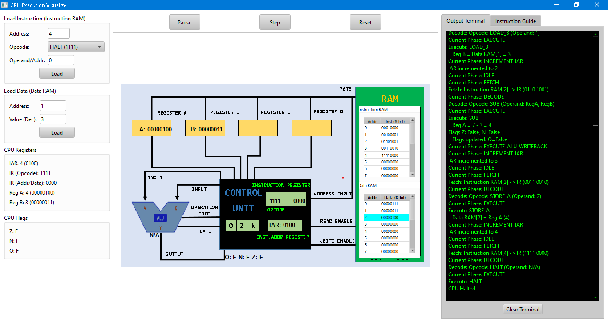

# CPU Visualizer

[](https://github.com/hkhuang07/CPU-Visualizer-Python-PyQt6/blob/main/assets/intro_app.gif)
<p align="center">
  <h3>Main Interface with Instruction Guide Tab</h3>
  
  <br>
  <em>The main application interface – where all functionalities are intuitively connected.</em>
</p>

<p align="center">
  <h3>Main Interface with Program Output Tab</h3>
  
  <br>
  <em>The main application interface - program running subtract operator between 2 register a and register b.</em>
</p>
---

## Introduction

The **CPU Visualizer** is an interactive simulation and visualization tool for a simplified 8-bit Central Processing Unit (CPU), developed using **Python** and the **PyQt6** framework. This project offers a dynamic way to understand fundamental computer architecture by illustrating the CPU's core operations: instruction fetching, decoding, and execution. You can observe in real-time how data flows, how registers and flags change, and how memory is accessed. It's an ideal educational resource for students and enthusiasts alike who want to demystify the inner workings of a CPU.

---

## Key Features

The CPU Visualizer provides a comprehensive set of features designed to enhance your understanding of CPU operations:

* **Simplified CPU Model:** At its heart, the visualizer simulates a custom 8-bit CPU. This model includes **16 addresses for Program RAM** (for storing instructions) and **16 addresses for Data RAM** (for storing data values). This compact size makes it easy to grasp the entire memory layout and its interaction with the CPU.

* **Graphical Visualization:** The application presents a clear and intuitive graphical diagram of the CPU's main components. You'll see dedicated areas for the **Arithmetic Logic Unit (ALU)**, various **Registers** (including A, B, Instruction Address Register (IAR), and Instruction Register (IR)), the **Control Unit**, and distinct sections for **Program RAM** and **Data RAM**. This visual layout provides an immediate understanding of where operations are performed and where data resides.

* **Instruction Cycle Phases:** The visualizer meticulously demonstrates the classic **Fetch-Decode-Execute** instruction cycle. As you step through each instruction, you'll see the distinct phases highlighted, helping you understand the sequential steps a CPU takes to process a command.

* **Real-time Monitoring:** Keep a close eye on the CPU's internal state. The interface constantly updates the values of key registers (Registers A and B for data manipulation, and IAR for program flow). Additionally, it clearly shows the status of critical **flags**: the **Zero (Z)** flag, the **Negative (N)** flag, and the **Overflow (O)** flag, providing insight into the results of arithmetic operations.

* **Interactive Memory Management:** You have full control over the CPU's memory. Load custom instructions into **Program RAM** and specific data values into **Data RAM** directly through dedicated input forms. This allows for experimenting with different programs and data sets.

* **Flexible Execution Control:** The visualizer offers multiple ways to control the CPU's operation:
    * **Run Mode:** Execute your loaded program continuously until a `HALT` instruction is encountered or an error occurs.
    * **Step Mode:** Step through the instruction cycle one phase at a time. This is invaluable for detailed debugging and understanding.
    * **Reset Functionality:** Quickly reset all CPU registers and Data RAM to their initial states, allowing for easy program re-runs without reloading instructions into Program RAM.

* **Dynamic Signal Path Simulation:** One of the most engaging features is the animated visualization of data and control signals. When an operation occurs (e.g., data moving from RAM to a register, or an ALU calculation), animated lines on the CPU diagram simulate the actual electrical signals, providing a highly intuitive representation of data flow within the architecture.

---

## Instruction Set

The simulated 8-bit CPU operates with a concise instruction set, where each instruction is 8 bits long, consisting of a 4-bit opcode and a 4-bit operand/address/immediate value:

| Opcode (4-bit) | Instruction Name | Description                                                               | Operands       |
| :------------- | :--------------- | :------------------------------------------------------------------------ | :------------- |
| `0000`         | `NOP`            | No Operation. The CPU simply proceeds to the next instruction.            | None           |
| `0001`         | `LOAD_A`         | Loads an 8-bit value from the specified `Data RAM[Addr]` into `Register A`. | `Addr` (4-bit) |
| `0010`         | `LOAD_B`         | Loads an 8-bit value from the specified `Data RAM[Addr]` into `Register B`. | `Addr` (4-bit) |
| `0011`         | `STORE_A`        | Stores the 8-bit value from `Register A` into the specified `Data RAM[Addr]`. | `Addr` (4-bit) |
| `0100`         | `STORE_B`        | Stores the 8-bit value from `Register B` into the specified `Data RAM[Addr]`. | `Addr` (4-bit) |
| `0101`         | `ADD`            | Performs addition: `Register A = Register A + Register B`. Updates the Zero (Z), Negative (N), and Overflow (O) flags based on the result. | Regs           |
| `0110`         | `SUB`            | Performs subtraction: `Register A = Register A - Register B`. Updates the Zero (Z), Negative (N), and Overflow (O) flags based on the result. | Regs           |
| `0111`         | `JUMP`           | Unconditionally jumps program execution to the instruction located at `Program RAM[Addr]`. | `Addr` (4-bit) |
| `1000`         | `JUMP_NEG`       | Conditionally jumps program execution to `Program RAM[Addr]` only if the Negative (N) flag is currently set. | `Addr` (4-bit) |
| `1001`         | `JUMP_ZERO`      | Conditionally jumps program execution to `Program RAM[Addr]` only if the Zero (Z) flag is currently set. | `Addr` (4-bit) |
| `1010`         | `ADDI`           | Performs immediate addition: `Register A = Register A + Immediate_Value`. Updates the Zero (Z), Negative (N), and Overflow (O) flags based on the result. The Immediate_Value is derived from the 4-bit operand. | `Data` (4-bit) |
| `1111`         | `HALT`           | Stops program execution. The CPU enters a halted state.                 | None           |

---

## Examples

### Addition Operation (`ADD`)

This example demonstrates a basic addition. We load two values into Data RAM, transfer them to Register A and Register B, and then execute the `ADD` instruction. Observe the ALU performing the calculation and the result updating Register A, along with the flag changes.

[](https://github.com/hkhuang07/CPU-Visualizer-Python-PyQt6/blob/main/assets/add.gif)

### Subtraction Operation (`SUB`)

In this illustration, we perform a subtraction. Values are loaded into Register A and Register B, and the `SUB` instruction is executed. Pay attention to the ALU's activity, the updated value in Register A, and how the Z, N, and O flags reflect the outcome of the subtraction.

[](https://github.com/hkhuang07/CPU-Visualizer-Python-PyQt6/blob/main/assets/sub.gif)

---

## Installation and Running

To get the CPU Visualizer up and running, you'll need **Python 3.x** (or newer) and the **PyQt6** library.

1.  **Clone the repository:**

    ```bash
    git clone [https://github.com/hkhuang07/CPU-Visualizer-Python-PyQt6.git](https://github.com/hkhuang07/CPU-Visualizer-Python-PyQt6.git)
    cd CPU-Visualizer-Python-PyQt6
    ```

2.  **Install PyQt6:**

    ```bash
    pip install PyQt6
    ```

3.  **Run the application:**

    ```bash
    python -m main
    ```

    **Note:** Ensure `main.py` and `cpu_core.py` (and `gui_elements.py` if it exists) are located in the main directory of the cloned repository for the `python -m main` command to work correctly.

---

## Usage Guide

The CPU Visualizer's intuitive interface makes it easy to interact with the simulated CPU:

1.  **Loading Instructions (Program RAM):**
    * Navigate to the "Load Instruction (Instruction RAM)" frame on the left panel.
    * Enter the desired **Address** (0-15) where the instruction will be stored.
    * Select the **Opcode** from the convenient dropdown list, which includes all supported instructions.
    * If the chosen instruction requires an operand (like an address for `LOAD` or `JUMP`, or an immediate value for `ADDI`), enter the **Operand/Addr** (a 4-bit value, 0-15).
    * Click the **Load** button to write the instruction to Program RAM.

2.  **Loading Data (Data RAM):**
    * Use the "Load Data (Data RAM)" frame, also on the left panel.
    * Enter the **Address** (0-15) for your data.
    * Input the **Value (Dec)**, which should be a decimal integer between 0 and 255 (representing an 8-bit unsigned value).
    * Click the **Load** button to store the data into Data RAM.

3.  **Controlling CPU Execution:**
    * **Run:** Press this button to initiate continuous execution of the program stored in Program RAM. The CPU will process instructions one after another until it encounters a `HALT` instruction or an unexpected error.
    * **Step:** For detailed analysis, use the `Step` button to advance the CPU through exactly one phase of the instruction cycle (Fetch, Decode, Execute, or IAR Increment). This allows for granular observation of internal changes.
    * **Reset:** This button quickly resets all CPU registers (A, B, IAR, IR) and status flags (Z, N, O) to their default initial values. It also clears all data from Data RAM. Notably, the contents of Program RAM remain intact, allowing you to re-run the same program effortlessly.

4.  **Monitoring CPU Status:**
    * **CPU Diagram:** The central part of the application, showing the visual representation of the CPU and its components. Watch the animated signals to understand data flow.
    * **CPU Registers & Flags:** Located on the left panel, these displays show the precise numerical values of all active registers and the boolean (True/False) state of each CPU flag.
    * **Instruction RAM & Data RAM Tables:** On the diagram itself, these tables provide a clear view of the binary content stored at each address in both your instruction and data memories.
    * **Output Terminal:** A dedicated tab on the right panel provides a verbose text log of the CPU's activities. It details each instruction phase, including specific operations performed, register changes, and flag updates, making it a powerful debugging and learning tool.
    * **Instruction Guide Tab:** Also on the right, this tab serves as a quick reference for the CPU's entire instruction set, including opcodes, names, descriptions, and operand requirements.

---

## Project Structure

The project is organized into modular Python files for clarity and maintainability:

* `main.py`: This is the primary entry point for the application. It orchestrates the creation of the main graphical user interface (GUI) window and manages the overall application logic, including user interactions and tying together the CPU simulation with the visual components.
* `cpu_core.py`: This file defines the core `CPU` class. It encapsulates all the fundamental CPU components, such as registers, Program RAM, Data RAM, and status flags. It also contains the essential methods that implement the Fetch-Decode-Execute cycle, defining how the CPU processes instructions at an architectural level.
* `gui_elements.py`: This file (if present in your final project structure, as indicated by the import) is intended to house specific helper classes or functions that support dynamic GUI elements. This could include classes like `SignalAnimator`, which handles the visual animations of data flow on the CPU diagram.
* `assets/`: This directory is crucial for the visualizer's appearance and demonstrations. It contains the main CPU diagram image (`cpu-diagram01.PNG`) that forms the background of the simulation, as well as the animated GIF files (`introduce.gif`, `add.gif`, `sub.gif`) used for README examples and project demonstration.

---

## Author

* **Huynh Quoc Huy** - [GitHub Profile: https://github.com/hkhuang07/](https://github.com/hkhuang07/)

---

## Repository

* You can find the full source code and contribute to this project here: [CPU-Visualizer-Python-PyQt6: https://github.com/hkhuang07/CPU-Visualizer-Python-PyQt6/](https://github.com/hkhuang07/CPU-Visualizer-Python-PyQt6)

---

## License

This project is open-source and distributed under the **MIT License**. For complete details, please refer to the `LICENSE` file within the repository.

---
